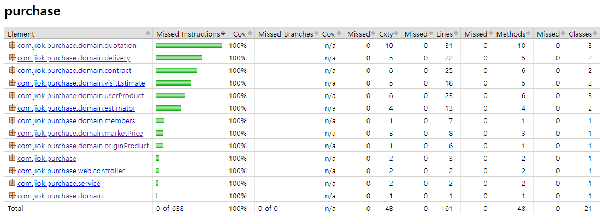

# 지옥이들의 쇼핑몰 프로젝트
## [프로젝트 개요]
소비자들이 물건을 사고 팔 수 있는 쇼핑몰 구축 프로젝트
## [모듈 개요]
Purchase 모듈은 소비자에게 물건을 구매하는 API를 담당하는 모듈이다.  
## [GITHUB 주소]
https://github.com/JIOK-s/Purchase

## [웹 어플리케이션 아키텍처]


## [워크플로우]
### 코드 작성 플로우(TDD)
1. 테스트코드 작성
2. 로직 작성
3. 테스트 확인
4. jacoco를 통해 테스트커버리지 80 이상 시 빌드 가능
5. 레포트 확인



## [개발환경]
- JAVA ver.11.0.13
- DB : mysql 8.0.32
- Spring boot : ver.2.7.10

## [ERD]
### 매입파트


## [발생한 문제와 해결]
#### 테이블 PK
  - 일상 생활에서 사용하는 객체의 속성이 아닌 프로젝트에서 사용하는 고유의 채번을 활용했다.
    - 일상 생활에서 사용하는 객체의 속성은 바뀔 수 있기 때문에
    - ex) 주민등록번호 - 개인정보 보호로 인한 마스킹으로 인해 PK로 사용불가할 수 있음
    
#### 유저상품정보를 상속받는 차량상품과 일반상품이 상속되지 않는 문제 발생
  - @builder 어노테이션을 수정
    - @builder 어노테이션은 상속되지 않기 때문에

#### EC2 배포 쉘파일 no main manifest attribute in 에러
  - 프로젝트명-0.0.1-SNAPSHOT-plain.jar 파일에서 처음 실행할 main 메소드를 찾지 못하는 문제
    - 배포 스크립트에서 JAR_NAME을 프로젝트명-0.0.1-SNAPSHOT.jar로 명시한다.

#### TRAVIS.YML 작성 시 gradle permission denied 에러
  - YML파일에 다음과 같은 내용을 추가하면 된다.
    - `before_install:  - chmod +x gradlew`

#### TRAVIS 서버에서 빌드 및 테스트 시 DB 접근 불가 에러
  - DB정보가 없는 APPLICATION.YML을 이용하여 GRADLE BUILD를 할 시 오류가 생김
    - BUILD시 테스트를 제외한다.
    - 코드는 다음과 같다. `./gradlew clean build -x test`

#### TRAVIS DEPLOY BRANCH 에러
  - TRAVIS는 기본적으로 MASTER BRANCH가 아닌 경우에 DEPLOY를 진행하지 않게 세팅되어 있다.
   - 다음과 같이 사용하고자 하는 BRANCH 권한을 열어야 한다.

       ```yaml
       deploy: 
         on:  
           branch: develop
       ```

#### AWS CODEDEPLOY 에러
  - appsec.yml 에서 destionation을 설정할 시 ‘~/ ‘는 먹히지 않는다
    - /home/ec2-user/ 를 사용해야 한다.

#### GITHUB 충돌
  - 원인: pr의 경우도 원격의 sync fork와 local의 pull이 필요한데 그 절차가 생략되었다.
    - 해결 : local 브랜치에 새로운 브랜치를 따서 원격의 내용을 pull 받고, non-fast-forward 방식으로 merge 한다. 코드는 다음과 같다.
      `git merge --no-ff hyunji-ok-develop`


## [알게된 점]
#### 관계별 외래키 정리
  - 일대다, 다대다, 다대일, 일대일 등의 관계에서 다 쪽의 테이블에 외래키를 관리한다.

#### Builder Annotation 구현
  - new 연산자 대신 클래스.builder()를 사용
    - 클래스().builer()가 아님에 주의

#### @Autowired vs @PersistenceContext
  - @Autowired가 스프링 빈을 주입
  - @PersistenceContext는 JPA 스펙에서 제공하는 기능인데, 영속성 컨텍스트를 주입하는 표준 애노테이션이다.

#### Spring Data JPA 사용자 정의 Repository 사용시 @REPOSITORY를 사용하지 않아도 의존성 주입이 가능
  - Spring 로딩시 자동으로 사용자 정의 basePackage에서 접미어가 Impl인 것을 찿아 JapRespoitory Injection시에 Impl 객체를 삽입한다

#### Fast-Forward와 Non-Fast-Forward 병합의 주요 차이점
  - Fast-Forward:
    - 브랜치 히스토리가 선형적으로 유지됩니다.
    - 추가 커밋이 생성되지 않습니다.
    - 작업 내용이 병합 대상 브랜치와 현재 브랜치 간의 변경 내용을 통합하기 어려울 경우에는 사용되지 않을 수 있습니다.
  - Non-Fast-Forward:
    - 브랜치 히스토리가 가지각색으로 보이게 됩니다.
    - 추가 병합 커밋이 생성되어 브랜치 간의 변경 내용을 통합합니다.
    - 작업 내용이 병합 대상 브랜치와 현재 브랜치 간의 변경 내용을 세밀하게 통합해야 할 경우에 사용됩니다.

## [업무일지]
[2023년 2분기 업무일지](https://github.com/JIOK-s/Purchase/blob/develop/readmeDir/meetingLog/2023Y_2Q.md)<br>
[2023년 3분기 업무일지](https://github.com/JIOK-s/Purchase/blob/develop/readmeDir/meetingLog/2023Y_3Q.md)<br>