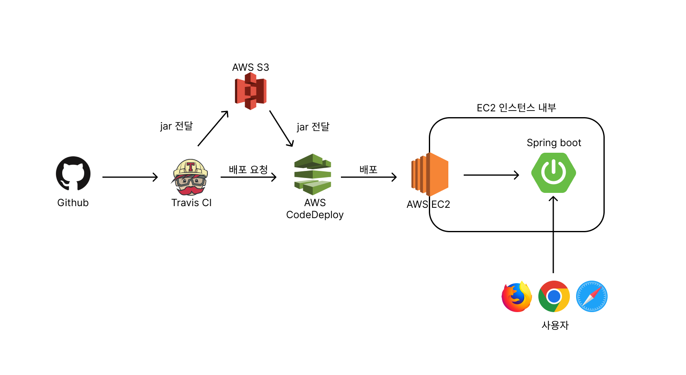

# 지옥이들의 쇼핑몰 프로젝트
## [워크플로우]


## [개발환경]
- JAVA ver.11.0.13
- DB : mysql 8.0.32
- Spring boot : ver.2.7.10

## [ERD]
### 매입파트


## [발생한 문제와 해결]
#### 테이블 PK
  - 일상 생활에서 사용하는 객체의 속성이 아닌 프로젝트에서 사용하는 고유의 채번을 활용했다.
    - 일상 생활에서 사용하는 객체의 속성은 바뀔 수 있기 때문에
    - ex) 주민등록번호 - 개인정보 보호로 인한 마스킹으로 인해 PK로 사용불가할 수 있음
    
#### 유저상품정보를 상속받는 차량상품과 일반상품이 상속되지 않는 문제 발생
  - @builder 어노테이션을 수정
    - @builder 어노테이션은 상속되지 않기 때문에

#### EC2 배포 쉘파일 no main manifest attribute in 에러
  - 프로젝트명-0.0.1-SNAPSHOT-plain.jar 파일에서 처음 실행할 main 메소드를 찾지 못하는 문제
    - 배포 스크립트에서 JAR_NAME을 프로젝트명-0.0.1-SNAPSHOT.jar로 명시한다.

#### TRAVIS.YML 작성 시 gradle permission denied 에러
  - YML파일에 다음과 같은 내용을 추가하면 된다.
    - `before_install:  - chmod +x gradlew`

#### TRAVIS 서버에서 빌드 및 테스트 시 DB 접근 불가 에러
  - DB정보가 없는 APPLICATION.YML을 이용하여 GRADLE BUILD를 할 시 오류가 생김
    - BUILD시 테스트를 제외한다.
    - 코드는 다음과 같다. `./gradlew clean build -x test`

#### TRAVIS DEPLOY BRANCH 에러
  - TRAVIS는 기본적으로 MASTER BRANCH가 아닌 경우에 DEPLOY를 진행하지 않게 세팅되어 있다.
   - 다음과 같이 사용하고자 하는 BRANCH 권한을 열어야 한다.

       ```yaml
       deploy: 
         on:  
           branch: develop
       ```


### AWS CODEDEPLOY 에러
  - appsec.yml 에서 destionation을 설정할 시 ‘~/ ‘는 먹히지 않는다
    - /home/ec2-user/ 를 사용해야 한다.

## [알게된 점]
#### 관계별 외래키 정리
  - 일대다, 다대다, 다대일, 일대일 등의 관계에서 다 쪽의 테이블에 외래키를 관리한다.

#### Builder Annotation 구현
  - new 연산자 대신 클래스.builder()를 사용
    - 클래스().builer()가 아님에 주의

## [업무일지]
[링크](./readmeDir/meetingLog/README.md)