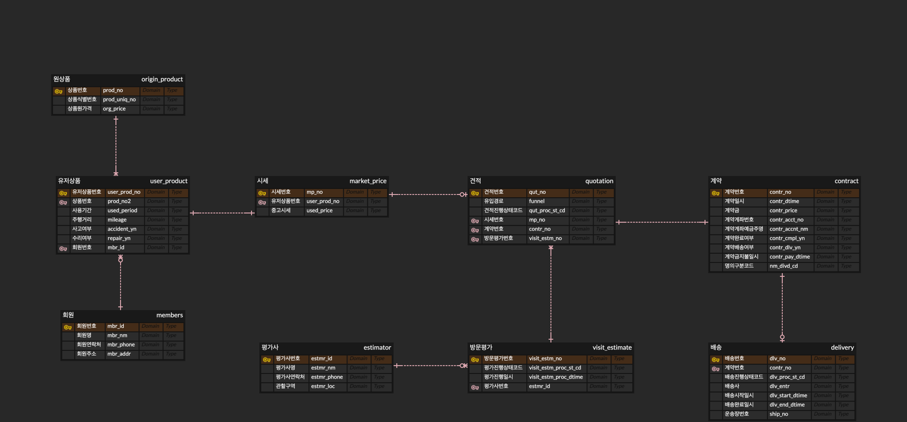

# 지옥이들의 쇼핑몰 프로젝트
## [워크플로우]

## [개발환경]
- JAVA ver.11.0.13
- DB : mysql 8.0.32
- Spring boot : ver.2.7.10

## [ERD]
### 매입파트

## [발생한 문제와 해결]
#### 테이블 PK
  - 일상 생활에서 사용하는 객체의 속성이 아닌 프로젝트에서 사용하는 고유의 채번을 활용했다.
    - 일상 생활에서 사용하는 객체의 속성은 바뀔 수 있기 때문에
    - ex) 주민등록번호 - 개인정보 보호로 인한 마스킹으로 인해 PK로 사용불가할 수 있음
    - 
#### 유저상품정보를 상속받는 차량상품과 일반상품이 상속되지 않는 문제 발생
  - @builder 어노테이션을 수정
    - @builder 어노테이션은 상속되지 않기 때문에

## [알게된 점]
#### 관계별 외래키 정리
  - 일대다, 다대다, 다대일, 일대일 등의 관계에서 다 쪽의 테이블에 외래키를 관리한다.

## [업무일지]
[링크](./readmeDir/meetingLog/README.md)